# Vault & Vellum 🏛️

> **Inteligentne Archiwum Dokumentów Domowych**  
> Bezpieczne przechowywanie, automatyczna kategoryzacja i łatwe udostępnianie dokumentów — w jednym miejscu.

---

## 📋 Spis treści

- [Opis projektu](#opis-projektu)
- [Technologie](#technologie)
- [Ekrany aplikacji](#ekrany-aplikacji)
- [Uruchomienie lokalne](#uruchomienie-lokalne)
- [Konfiguracja Firebase](#konfiguracja-firebase)
- [Konfiguracja Contentsquare / Hotjar](#konfiguracja-contentsquare--hotjar)
- [Konfiguracja Google Analytics](#konfiguracja-google-analytics)
- [Analityka — screenshoty](#analityka--screenshoty)
- [Deploy](#deploy)

---

## Opis projektu

**Vault & Vellum** to aplikacja webowa do zarządzania dokumentami domowymi. Umożliwia:

- 🔐 **Bezpieczne logowanie** — Firebase Authentication (email + hasło)
- 📁 **Archiwizację dokumentów** — kategoryzacja, filtrowanie, wyszukiwanie
- 📤 **Upload plików** — dodawanie nowych dokumentów do archiwum
- 🤖 **Weryfikację AI/OCR** — podgląd wyników automatycznej kategoryzacji
- 🔗 **Udostępnianie** — zarządzanie dostępem do dokumentów

---

## Technologie

| Warstwa | Technologia |
|---------|-------------|
| Framework | React 18 + TypeScript |
| Build tool | Vite |
| Routing | React Router v6 |
| Stylowanie | Tailwind CSS v3 |
| Ikony | Google Material Symbols |
| Czcionki | Manrope (nagłówki) + Inter (tekst) |
| Autentykacja | Firebase Authentication |
| Analityka | Google Analytics 4 |
| Heatmapy | Hotjar |

---

## Ekrany aplikacji

### Ekran logowania (`/`)
> Formularz logowania z walidacją Firebase — obsługa błędów (złe hasło, zbyt wiele prób, etc.)

<!-- Dodaj screenshot: docs/screenshots/login.png -->
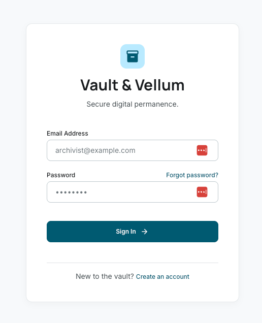

---

### Rejestracja (`/register`)
> Tworzenie nowego konta z walidacją hasła i akceptacją regulaminu

<!-- Dodaj screenshot: docs/screenshots/register.png -->
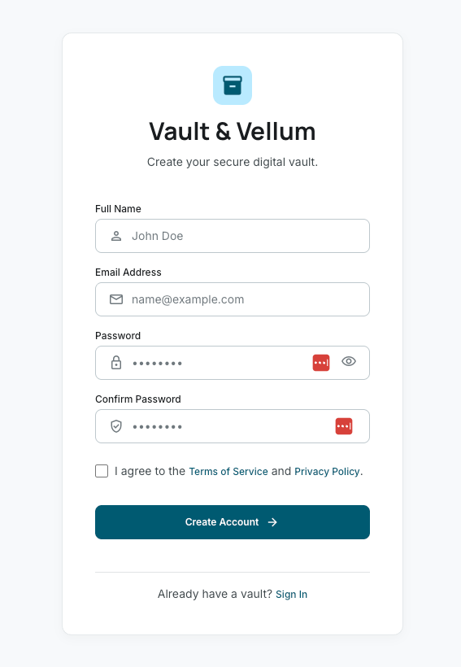

---

### Archiwum dokumentów (`/archive`)
> Główny widok z listą dokumentów, filtrowaniem po kategorii i wyszukiwaniem

<!-- Dodaj screenshot: docs/screenshots/archive.png -->
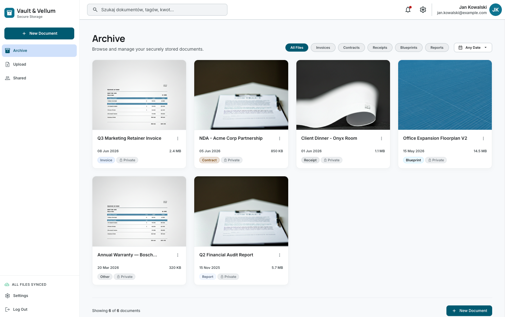

---

### Udostępnione (`/shared`)
> Dokumenty udostępnione przez innych użytkowników z zarządzaniem dostępem

<!-- Dodaj screenshot: docs/screenshots/shared.png -->
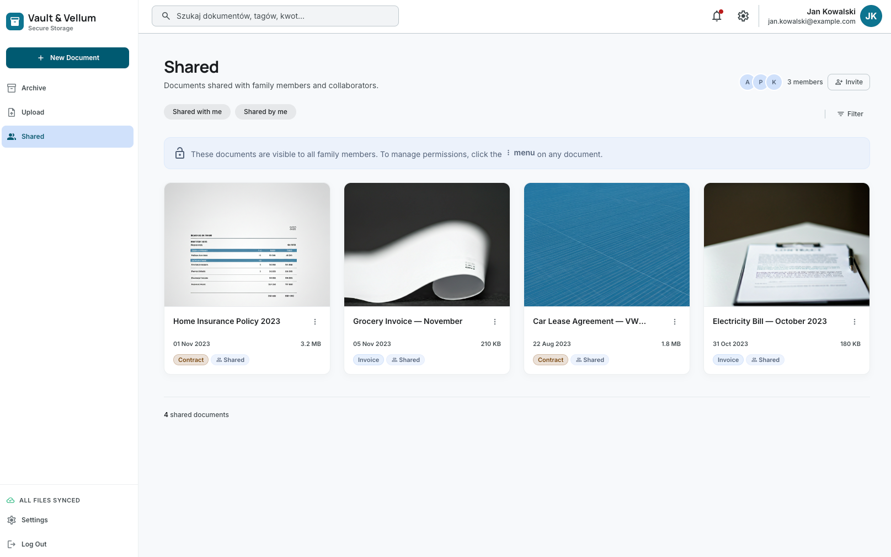

---

### Upload (`/upload`)
> Przeciągnij & upuść lub wybierz pliki do archiwizacji

<!-- Dodaj screenshot: docs/screenshots/upload.png -->
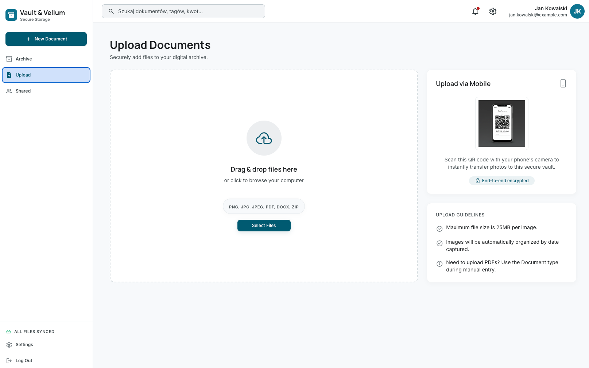

---

### Przetwarzanie (`/processing`)
> Animowany widok oczekiwania na wyniki OCR/AI

<!-- Dodaj screenshot: docs/screenshots/processing.png -->
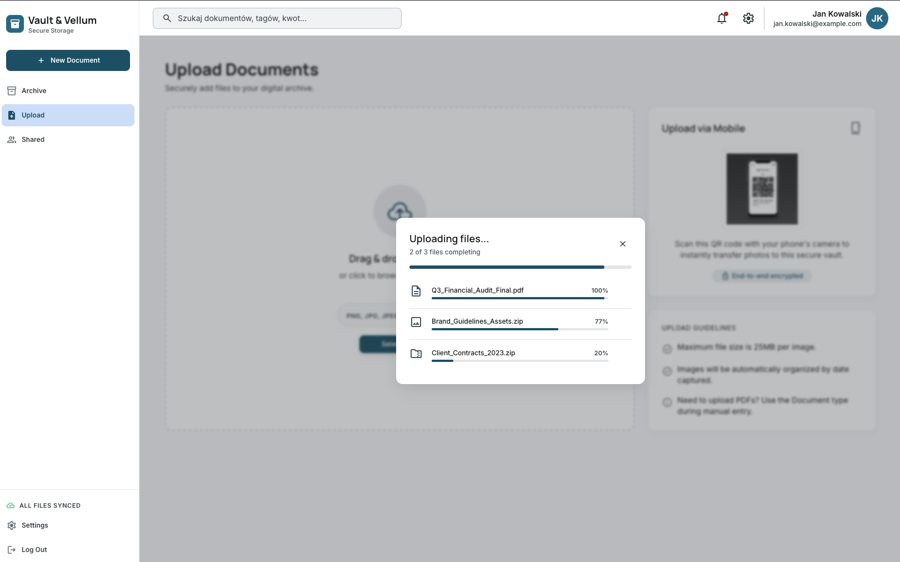

---

### Weryfikacja (`/verification`)
> Podgląd i potwierdzenie danych wyekstrahowanych przez AI

<!-- Dodaj screenshot: docs/screenshots/verification.png -->
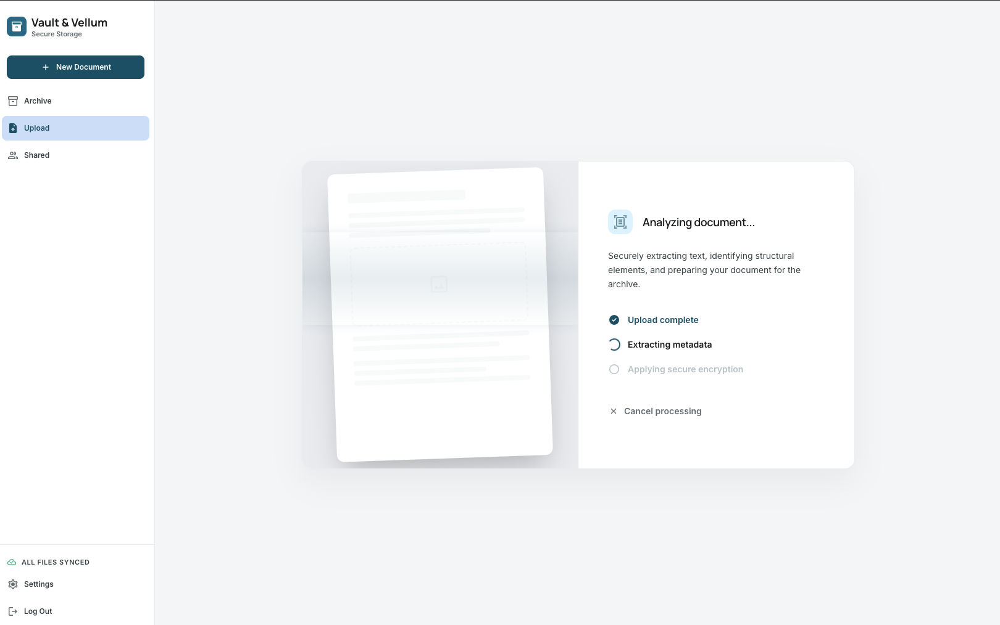

---

### Sukces (`/success`)
> Potwierdzenie pomyślnego zarchiwizowania dokumentu

<!-- Dodaj screenshot: docs/screenshots/success.png -->
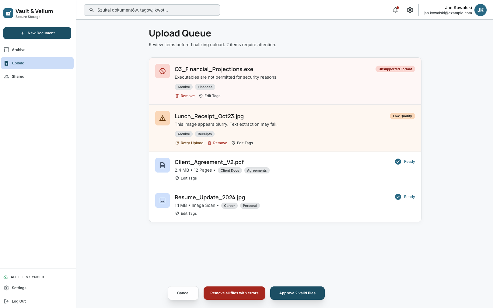

---

## Uruchomienie lokalne

```bash
# 1. Sklonuj repozytorium
git clone <URL_REPO>
cd TPF-project

# 2. Zainstaluj zależności
npm install

# 3. Skonfiguruj zmienne środowiskowe
cp .env.example .env
# → uzupełnij .env swoimi kluczami Firebase (patrz sekcja niżej)

# 4. Uruchom serwer deweloperski
npm run dev
```

Aplikacja będzie dostępna pod adresem: **http://localhost:5173**

---

## Konfiguracja Firebase

1. Wejdź na [Firebase Console](https://console.firebase.google.com)
2. Utwórz nowy projekt lub otwórz istniejący
3. **Authentication** → Sign-in method → **Email/Password** → Włącz
4. **Project Settings** → Your apps → Add app → **Web** → skopiuj config
5. Uzupełnij plik `.env` w katalogu projektu:

```env
VITE_FIREBASE_API_KEY=AIza...
VITE_FIREBASE_AUTH_DOMAIN=twoj-projekt.firebaseapp.com
VITE_FIREBASE_PROJECT_ID=twoj-projekt
VITE_FIREBASE_STORAGE_BUCKET=twoj-projekt.appspot.com
VITE_FIREBASE_MESSAGING_SENDER_ID=123456789
VITE_FIREBASE_APP_ID=1:123:web:abc
```

---

## Konfiguracja Contentsquare / Hotjar

Skrypt śledzący Contentsquare został zintegrowany bezpośrednio w sekcji `<head>` pliku `index.html`:

```html
<script src="https://t.contentsquare.net/uxa/bd2762d6f1bc6.js" defer></script>
```

W przypadku chęci zmiany konta/identyfikatora w przyszłości, zaktualizuj powyższy skrypt w pliku `index.html`.

---

## Konfiguracja Google Analytics

1. Wejdź na [analytics.google.com](https://analytics.google.com)
2. Utwórz nową właściwość → **Web**
3. Skopiuj **Measurement ID** (format: `G-XXXXXXXXXX`)
4. W pliku `index.html` zamień oba wystąpienia `G-XXXXXXXXXX` na swoje ID:

```html
<script async src="https://www.googletagmanager.com/gtag/js?id=G-TWOJE_ID"></script>
<script>
  gtag('config', 'G-TWOJE_ID');
</script>
```

---

## Analityka — screenshoty

### Google Analytics — przegląd ruchu

<!-- Dodaj screenshot z panelu GA4 -->
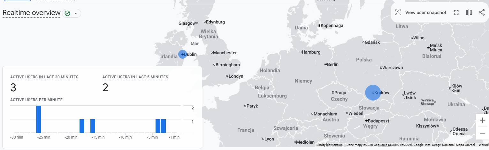

### Google Analytics — zdarzenia

<!-- Dodaj screenshot z sekcji Events w GA4 -->
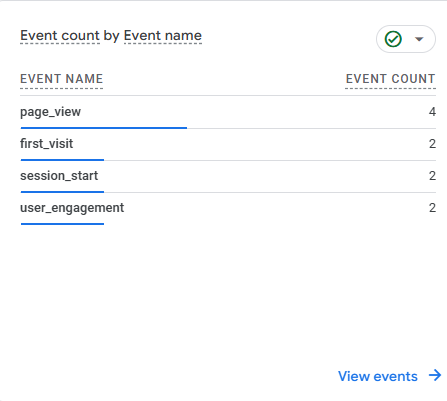

### Hotjar — heatmapa

<!-- Dodaj screenshot heatmapy z Hotjar -->
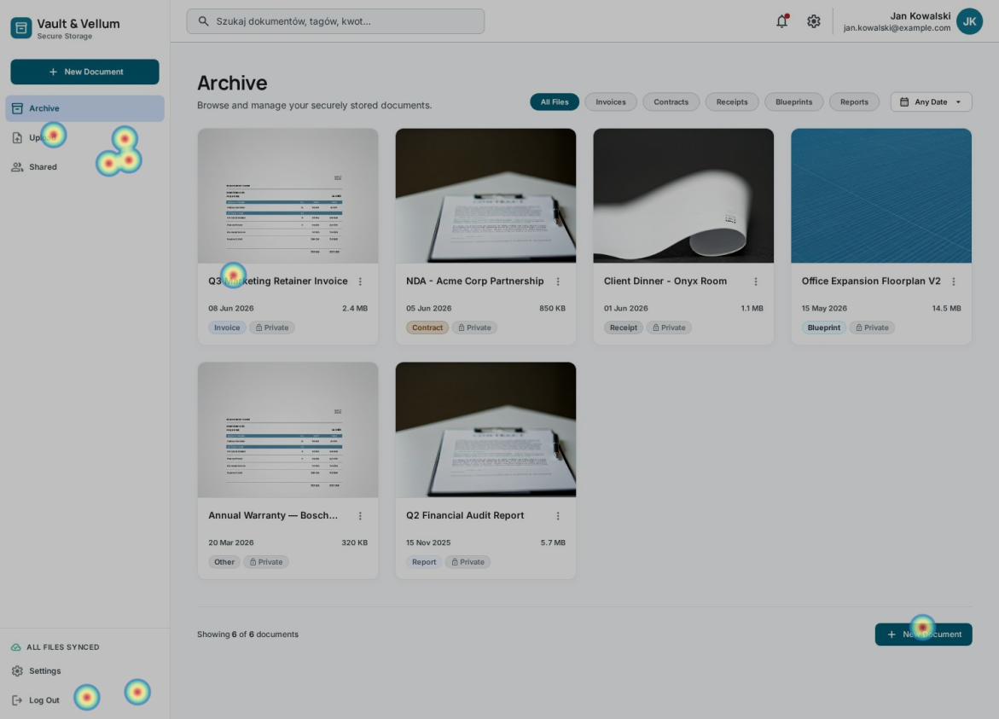

---

## Deploy

Aplikacja jest wdrożona na platformie **[Vercel / Firebase Hosting]**:

🔗 **URL produkcyjny:** `https://twoja-aplikacja.vercel.app`

### Jak wdrożyć na Vercel

```bash
# Zainstaluj Vercel CLI
npm i -g vercel

# Wdróż
vercel

# lub z wymuszonym buildem produkcyjnym
vercel --prod
```

Pamiętaj o ustawieniu zmiennych środowiskowych w panelu Vercel (Settings → Environment Variables).

---

## Struktura projektu

```
src/
├── components/        # Wielokrotnego użytku komponenty UI
│   ├── AppShell.tsx       # Layout (nawigacja + modal ustawień)
│   ├── SideNavBar.tsx     # Boczna nawigacja
│   ├── TopNavBar.tsx      # Górna belka z wyszukiwarką
│   ├── DocumentCard.tsx   # Karta dokumentu
│   ├── ManageAccessModal.tsx
│   └── Toast.tsx
├── views/             # Strony (jeden plik = jeden ekran)
│   ├── LoginView.tsx
│   ├── RegisterView.tsx
│   ├── ArchiveView.tsx
│   ├── SharedView.tsx
│   ├── UploadView.tsx
│   ├── ProcessingView.tsx
│   ├── VerificationView.tsx
│   └── SuccessView.tsx
├── routes/
│   └── AppRouter.tsx  # Definicje tras React Router
├── context/
│   ├── AuthContext.tsx    # Stan uwierzytelnienia Firebase
│   └── SearchContext.tsx  # Stan wyszukiwania
├── services/
│   ├── firebase.ts        # Inicjalizacja Firebase
│   ├── authService.ts     # Login / Register / Logout
│   └── documentsService.ts
└── types/             # Typy TypeScript
```

---

*Projekt wykonany w ramach przedmiotu TPF — Technologie Projektowania Frontendowego*
